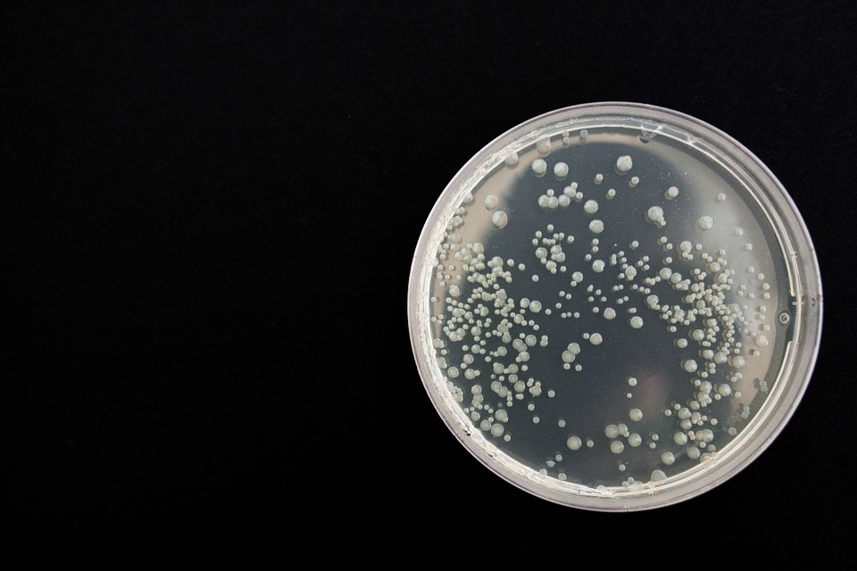

# Belly-Button-Biodiversity

An interactive dashboard to explore Belly Button Biodiversity dataset, which catalogs the microbes that colonize human navels.  

The dataset provided in .json format shows a small handful of microbial species (also called operational taxonomic units, or OTUs, in the study) were present in more than 70% of people, while the rest were relatively rare.

The data was prepared and already pre-sorted when provided. Plotly.js was used to create all the visualizations (graphs) in JavaScript. The dashboard has been deployed using Github pages.

Play with it yourself at: 
https://tbbsparks.github.io/Belly-Button-Biodiversity/

*About the Data
Hulcr, J. et al.(2012) A Jungle in There: Bacteria in Belly Buttons are Highly Diverse, but Predictable. Retrieved from: http://robdunnlab.com/projects/belly-button-biodiversity/results-and-data/
